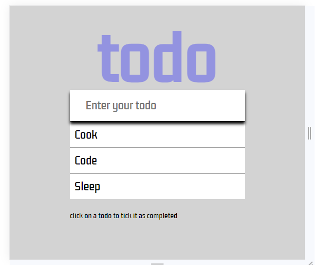
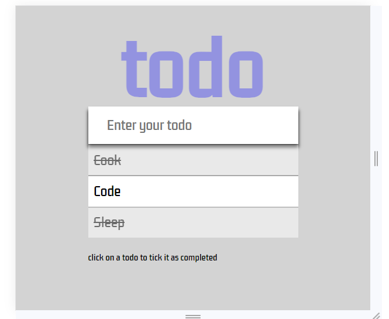

# TODO App

This project highlights a simple, dynamic, and interactive todo app created using HTML, CSS, and Vanilla JavaScript.

## Description

The TODO App provides a user-friendly interface for creating and managing your to-do list. It allows users to add new tasks, mark them as completed, and store the list locally. The app is designed to be straightforward and easy to use.

## Table of Contents

- [Features](#features)
- [How to Use](#how-to-use)
- [Project Structure](#project-structure)
- [Development](#development)
- [Local Storage](#local-storage)
- [License](#license)
- [Author](#author)

## Screenshots

1. Screenshot1

2. Screenshot2

## Features

- Add new tasks to the to-do list.
- Mark tasks as completed by clicking on them.
- Automatically stores tasks locally to persist data.

## How to Use

1. Open the `index.html` file in a web browser.
2. Enter your to-do item in the input field and press Enter or click the submit button.
3. Click on a to-do item to mark it as completed.
4. The app will automatically store your to-do list locally, ensuring your data is persistent.

## Project Structure

- `index.html`: HTML file containing the structure of the TODO App.
- `style.css`: CSS file for styling the TODO App interface.
- `script.js`: JavaScript file for creating the dynamic functionality of the TODO App.

## Development

To contribute to the project or make modifications, follow these steps:

1. Clone the repository.
2. Make changes to the HTML, CSS, or JavaScript files.
3. Test the changes in a web browser.
4. Submit a pull request if you would like to contribute your modifications.

## Local Storage

The app uses local storage to persistently store to-do items, ensuring that your tasks are saved even after you close the browser.

## License

This project is licensed under the MIT License - see the [LICENSE.md](LICENSE.md) file for details.

## Author

- **Hosea Nganga**

Feel free to use, modify, and contribute to this TODO App project!
